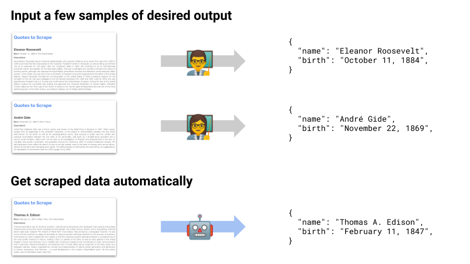

# Turn HTML intro structured data automatically with Machine Learning


`mlscraper` allows you to extract structured data from HTML automatically with Machine Learning.
You train it by providing a few examples of your desired output.
It will then be able to extract this information from any new page you provide.

## Background Story
Many services for crawling and scraping automation allow you to select data in a browser and get JSON results in return.
No need to specify CSS selectors or anything else.

I've been wondering for a long time why there's no Open Source solution that does something like this.
So here's my attempt at creating a python library to enable automatic scraping.

All you have to do is define some examples of scraped data.
`autoscraper` will figure out everything else and return clean data.

Currently, this is a proof of concept with a simplistic solution.

## How it works
After you've defined the data you want to scrape, mlscraper will:

- find your samples inside the HTML DOM
- determine which rules/methods to apply for extraction
- extract the data for you and return it in a dictionary

```python
from mlscraper import MultiItemScraper
from mlscraper.parser import make_soup_page
from mlscraper.training import MultiItemPageSample

# the items found on the training page
items = [
    {"title": "One great result!", "description": "Some description"},
    {"title": "Another great result!", "description": "Another description"},
    {"title": "Result to be found", "description": "Description to crawl"},
]

# training the scraper with the items
sample = MultiItemPageSample(make_soup_page(html), items)
scraper = MultiItemScraper.build([sample])
scraper.scrape(html)  # will produce the items above
scraper.scrape(new_html)  # will apply the learned rules and extract new items
```

## Getting started
Install the library locally via `pip install -e .`.
You can then import it via `mlscraper` and use it as shown in the examples.

## Related work
If you're interested in the underlying research, I can highly recommend these publications:

- Learning to extract hierarchical information from semi-structured documents: http://ftp.cse.buffalo.edu/users/azhang/disc/disc01/cd1/out/papers/cikm/p250.pdf
- WHISK: Extraction of structured and unstructured information: https://www.cis.uni-muenchen.de/~yeong/Kurse/ws0809/WebDataMining/whisk.pdf

I originally called this autoscraper but while working on it someone else released a library named exactly the same.
Check it out here: [autoscraper](https://github.com/alirezamika/autoscraper).
Check the git logs if you don't believe me :D